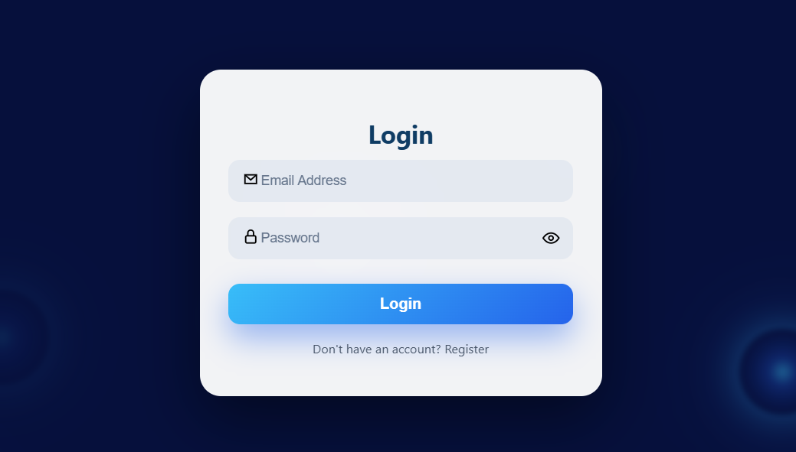
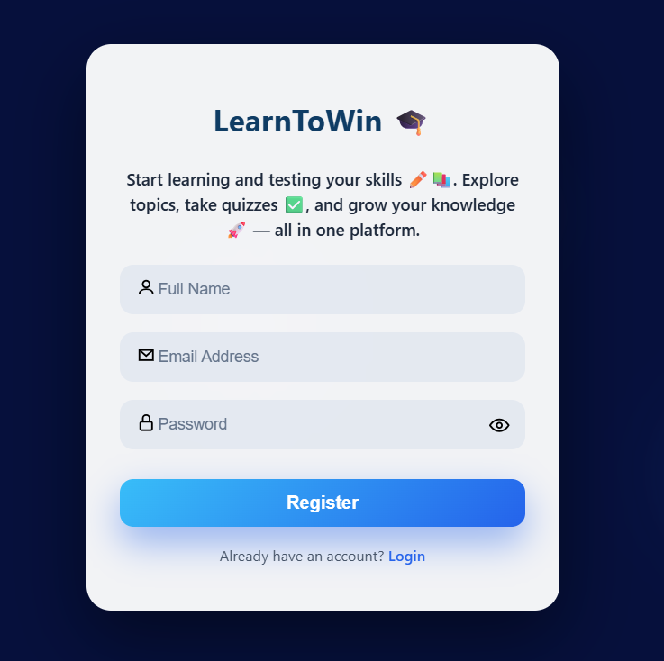

# 🚀 LearnToWin
## 🎓 Skill-Based Learning & Assessment Platform

**LearnToWin** is a secure full-stack MERN application that enables students to learn through structured skills, topics, and interactive assessments, while providing admins with full content management capabilities.


---

## 🔥 Project Overview
- Developed a full-stack skill-based learning platform using React.js, Node.js, Express.js, and MongoDB, enabling students to navigate skills → topics → content efficiently.
- Implemented secure role-based authentication (Admin / Student) using JWT, ensuring proper access control and separating administrative content management from learner-facing functionalities.
- Built an admin-driven dynamic content and quiz-based assessment system, allowing real-time management of skills, topics, and quizzes without redeployment, ensuring scalability and maintainability.

---

## 🧠 Key Features
- 🔐 **Secure Role-Based Authentication**  
  JWT-based login and registration for Admin and Student users, with strict route protection and role-based access control.
- 📚 **Structured Skill & Topic Management**  
  Admins can create, update, and delete skills and topics; students can browse content in a structured flow.
- 📝 **Dynamic Quiz & Assessment System**  
  Admin-managed quizzes linked to topics, supporting multiple-choice questions, scoring, and instant feedback.
- ⚡ **Scalable Full-Stack Architecture**  
  React frontend seamlessly integrated with Node.js, Express, and MongoDB backend with RESTful APIs.

## 🛠 Tech Stack

| Category            | Technologies Used                         |
|---------------------|-------------------------------------------|
| Frontend            | React.js, JavaScript (ES6+), HTML5, CSS3 |
| Backend             | Node.js, Express.js                       |
| Database            | MongoDB, Mongoose ODM                     |
| Authentication      | JSON Web Tokens (JWT)                     |
| API Architecture    | RESTful APIs                              |
| Version Control     | Git, GitHub                               |

---

## 📁 Folder Structure

```bash
LearnToWin/
│
├── client/                          # React frontend
│   ├── public/                      # Static assets
│   ├── src/
│   │   ├── api/                     # Axios instance for base URL and API calls
│   │   ├── app/                     # Redux store configuration
│   │   │   └── store.js
│   │   ├── redux/                   # Redux slices for state management
│   │   │   └── slices/             # Individual slice files
│   │   ├── routes/                  # Protected student and admin routes
│   │   ├── components/              # Reusable UI components
│   │   ├── pages/                   # Page-level components
│   │   │   ├── admin/               # Admin-specific pages
│   │   │   ├── student/             # Student-specific pages
│   │   │   └── auth/                # Login/Register pages
│   │   ├── App.js                   # Main App component
│   │   └── index.js                 # React entry point
│   └── package.json
│
├── server/                          # Express backend
│   ├── config/                      # Database configuration
│   ├── controllers/                 # Route business logic
│   ├── middleware/                  # JWT authentication & role-based middleware
│   ├── models/                      # Mongoose schemas (Users, Skills, Topics, Quizzes)
│   ├── routes/                      # API route definitions
│   ├── server.js                    # Backend entry point
│   └── package.json
│
└── README.md
```
## ⚙️ Setup Instructions

### 1️⃣ Clone the Repository
```bash
git clone https://github.com/Padma-darsi/LearnToWin-Skill-Based-Learning-And-Assessment-Platform.git
cd LearnToWin-Skill-Based-Learning-And-Assessment-Platform
```

### 2️⃣ Backend Setup
```bash
cd server
npm install
```

### Create a .env file in server/:

PORT=5000
MONGO_URI=your_mongodb_connection_string
JWT_SECRET=your_secret_key
```
### Start the backend server:
```bash
npm run dev
```

### 3️⃣ Frontend Setup
```bash
cd ../client
npm install
npm start
```

---

## 2️⃣ Application Flow (`🔄 Application Flow`)  
Show a simple diagram of how client requests flow through backend:

```markdown
### 🔄 Application Flow
Client (React Frontend)
        ↓
API Request (Axios instance)
        ↓
JWT Authentication & Role Middleware
        ↓
Controller Logic
        ↓
MongoDB Database
        ↓
Response to Client

## 📸 Screenshots


### 🔐 Authentication (Login & Register)
| Login | Register |
|-------|---------|
|  |  |

### 📚 Dashboard & Skills Overview


### 📝 Quiz Page

4️⃣ Live Demo (🌐 Live Demo)

Add your deployed links:

## 🌐 Live Demo

🚀 **Live Application:**  
https://learn-to-win-frontend.vercel.app/

🖥️ **Frontend:** Deployed on Vercel  
⚙️ **Backend:** Deployed on Render  
🗄️ **Database:** MongoDB Atlas
5️⃣ Contributing (📝 Contributing)

Explain how others can contribute:

## 📝 Contributing
- Fork the repository
- Create a branch for your feature
- Commit your changes
- Open a pull request
